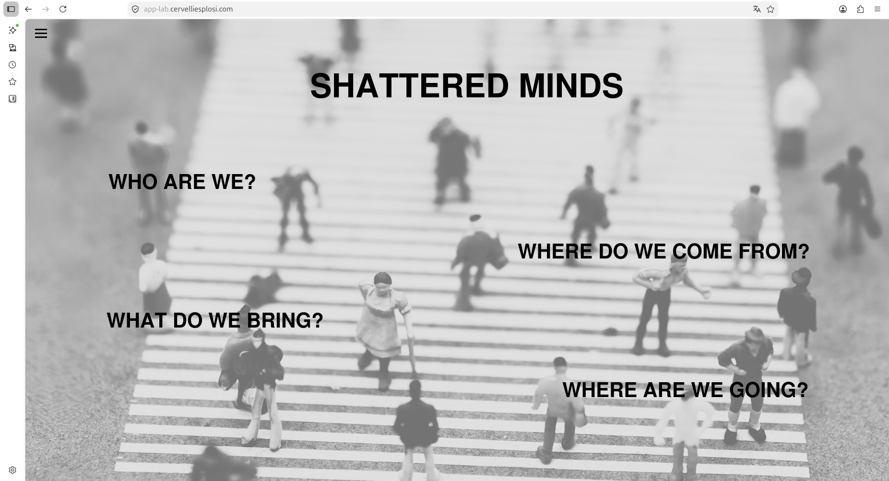
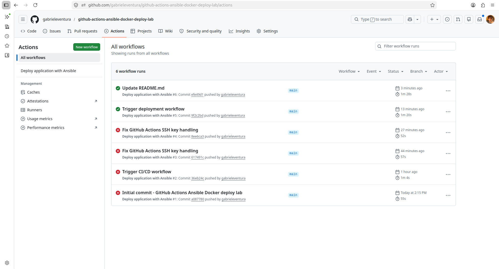
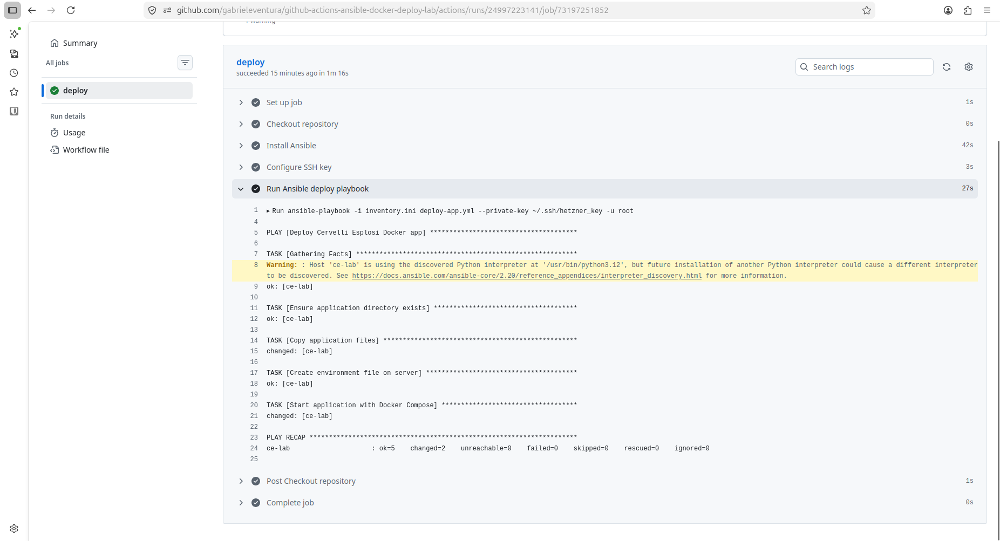

# GitHub Actions + Ansible + Docker Deploy Lab

Hands-on CI/CD project using GitHub Actions, Ansible and Docker Compose to automatically deploy a containerised application to a Hetzner Cloud VPS.

---

## Objective

Move from manual deployments to an automated pipeline where every push to the main branch triggers a remote deployment.

---

## Workflow

git push  
→ GitHub Actions pipeline starts  
→ SSH authentication using encrypted GitHub Secrets  
→ Ansible deploy playbook runs  
→ Docker Compose rebuild / restart on remote server  
→ Updated application goes live

---

## Technologies

- GitHub Actions
- Ansible
- Docker Compose
- Nginx reverse proxy
- Hetzner Cloud
- Ubuntu 24.04
- SSH
- GitHub Secrets

---

## What I Implemented

- Automated deployments triggered by git push
- Secure SSH authentication from GitHub Actions runner
- Remote Ansible playbook execution
- Container rebuild and restart workflow
- Live deployment to public HTTPS environment

---

## Real Troubleshooting Experience

During implementation I diagnosed and fixed issues including:

- SSH key authentication failures
- GitHub Actions secret handling
- Workflow debugging
- Remote deployment connectivity
- CI/CD rerun validation

---

## Live Environment

https://app-lab.cervelliesplosi.com

---

## Screenshots

### Live Application

### Successful GitHub Actions Deployment

### Workflow History (Failures Resolved)

---
